<div align="center">

<picture>
  <source media="(prefers-color-scheme: dark)" srcset="docs/assets/sih-2026-dark.png">
  
</picture>

<br><br>

# RakshaVaani (रक्षावाणी)

**Offline-First Multilingual Emergency Communication System**<br>
*Voice Communication Without Internet or Cellular Networks*

Smart India Hackathon 2026 · Team **StarkDynamics** · GMR Institute of Technology

<br>


<br>



</div>

<br>

> **When the network disappears, communication should not.**

RakshaVaani is an **offline-first multilingual emergency communication system** designed for disaster situations where cellular networks, internet connectivity, and conventional communication infrastructure may be unavailable.

Instead of transmitting voice recordings, RakshaVaani processes speech **on the device**, converts it into compact text data, securely transmits that data through available local radio technologies, and reconstructs the message as speech on the receiving device.

No internet. No SIM card. No cloud server.

---

## Why RakshaVaani?

During floods, cyclones, earthquakes, landslides, and other emergencies, communication infrastructure can become unreliable or completely unavailable.

Emergency communication faces two major challenges:

1. **Connectivity failure** — conventional messaging and calling applications depend on cellular or internet infrastructure.
2. **Language barriers** — responders and affected people may speak different Indian languages, making rapid communication difficult during emergencies.

RakshaVaani addresses both problems by combining:

- On-device Speech-to-Text
- Compact text-based communication
- Offline radio-based connectivity
- Store-and-forward relay
- Offline Text-to-Speech
- Multilingual communication
- Emergency alerts
- Secure message transmission

---

## How It Works

RakshaVaani follows a **Speech → Text → Radio → Text → Speech** pipeline.


The important design principle is that **audio itself does not need to cross the communication link**.

Speech is converted to text locally. Only the compact representation is transmitted. The receiver then converts the received message back into speech using its local TTS engine.

---

## Key Capabilities

### 🌐 100% Offline Communication

RakshaVaani is designed to operate without:

- Internet connectivity
- Cellular data
- SIM cards
- Cloud servers
- Conventional telecom infrastructure

The communication pipeline is designed to remain local to the participating devices.

### 🗣️ Multilingual Communication

The system is designed around support for **10 languages**:

| Language | Support |
| --- | :---: |
| English | ✓ |
| Hindi | ✓ |
| Telugu | ✓ |
| Tamil | ✓ |
| Marathi | ✓ |
| Bengali | ✓ |
| Gujarati | ✓ |
| Kannada | ✓ |
| Malayalam | ✓ |
| Odia | ✓ |

This allows emergency messages to be communicated across different regional language preferences.

### 📡 Offline Mesh Communication

RakshaVaani can use local communication technologies such as:

- Bluetooth
- BLE
- Wi-Fi Direct
- Local Wi-Fi communication
- Radio interfaces such as LoRa where available

The architecture also supports **store-and-forward relay**, allowing an intermediate device to forward a message when the sender and final receiver cannot communicate directly.

```text
PHONE A
  │
  │ Direct connection
  ▼
PHONE B
  │
  │ Relay
  ▼
PHONE C
```

### 🚨 Emergency Alerts

Emergency alerts are treated as high-priority communication.

The system can provide:

- Immediate alert delivery
- High-priority playback
- Visual alert indication
- Emergency acoustic notification

### 📍 Locate

RakshaVaani includes a **LOCATE** concept for helping users identify the direction/proximity of another participating device using radio signal information and acoustic feedback.

### 🔐 Secure Communication

The communication architecture uses:

**AES-256-GCM authenticated encryption**

This provides confidentiality and integrity for transmitted messages and helps prevent unauthorized message injection or modification.

---

## System Architecture

```text
┌─────────────────────────────────────────────────────────────┐
│                       SENDER PHONE                          │
│                                                             │
│  Microphone                                                │
│      │                                                      │
│      ▼                                                      │
│  Audio Capture                                              │
│      │                                                      │
│      ▼                                                      │
│  On-Device Speech-to-Text                                  │
│      │                                                      │
│      ▼                                                      │
│  Text Processing / Segmentation                             │
│      │                                                      │
│      ▼                                                      │
│  Compact Frame Encoding                                     │
│      │                                                      │
│      ▼                                                      │
│  AES-256-GCM Encryption                                     │
└──────────────────────┬──────────────────────────────────────┘
                       │
                       │ Offline Radio Link
                       │
          Bluetooth / BLE / Wi-Fi Direct
                       │
                       ▼
              ┌───────────────────┐
              │   OPTIONAL RELAY  │
              │                   │
              │ Deduplicate       │
              │ TTL / Hop Control │
              │ Forward           │
              └─────────┬─────────┘
                        │
                        ▼
┌─────────────────────────────────────────────────────────────┐
│                      RECEIVER PHONE                         │
│                                                             │
│  Receive Frame                                               │
│      │                                                      │
│      ▼                                                      │
│  Decrypt & Decode                                            │
│      │                                                      │
│      ▼                                                      │
│  Text Processing                                              │
│      │                                                      │
│      ▼                                                      │
│  Offline Text-to-Speech                                      │
│      │                                                      │
│      ▼                                                      │
│  🔊 Emergency Voice Output                                  │
└─────────────────────────────────────────────────────────────┘
```

---

## Transmission Levels

### Level 1 — Normal Speech Communication

The speaker's voice is processed locally by the STT engine.

```text
Speech
   ↓
STT
   ↓
Text
   ↓
Compact Frame
   ↓
Encryption
   ↓
Radio Transmission
```

The receiver performs the reverse operation and produces speech using offline TTS.

### Level 2 — Emergency Alert

Emergency alerts receive higher priority than normal communication and can trigger immediate visual and acoustic notification on receiving devices.

### Level 3 — Emergency Template Messages

For predefined emergency situations, compact template-based messages can be used to reduce the amount of data that needs to be transmitted.

Examples include:

- Medical assistance required
- Emergency evacuation
- Fire detected
- Need rescue
- Location assistance required

---

## Mesh Relay

A key feature of RakshaVaani is the ability to use participating devices as relay nodes.


Each relay can:

1. Receive the packet.
2. Check whether it has already been seen.
3. Apply hop/TTL rules.
4. Forward the packet when required.

This makes it possible to extend communication beyond the direct radio range of a single handset.

---

## Technology Stack

| Layer | Technology |
| --- | --- |
| Platform | Android |
| Language | Kotlin |
| UI | Jetpack Compose |
| Speech Recognition | On-device Indic STT |
| Speech Synthesis | Offline TTS |
| Inference | Sherpa-ONNX / ONNX Runtime |
| Audio | Android Audio APIs |
| Communication | Bluetooth / BLE / Wi-Fi Direct |
| Security | AES-256-GCM |
| Architecture | Modular Android |
| Build | Gradle |

---

## AI Pipeline

### Speech-to-Text

RakshaVaani uses lightweight, on-device speech recognition so that speech can be converted to text without sending audio to a remote server.

The target pipeline is:

```text
Microphone
    ↓
Audio Capture
    ↓
Streaming STT
    ↓
Recognised Text
```

### Text-to-Speech

Received text is synthesized locally:

```text
Received Text
    ↓
Text Normalisation
    ↓
Offline TTS
    ↓
Audio Output
```

This keeps the complete communication loop independent of cloud services.

---

## Project Structure

The project follows a modular Android architecture.

```text
sih2026/
│
├── app/                  # Main Android application and UI
│
├── core-proto/           # Frame encoding, decoding and security
│
├── core-audio/           # Audio capture and playback
│
├── core-asr/             # Speech-to-Text integration
│
├── core-tts/             # Text-to-Speech integration
│
├── core-link/            # Offline communication transports
│
├── core-models/          # AI model and language resources
│
├── bench/                # Performance and latency testing
│
├── models/               # Model manifests and language data
│
├── tools/                # Build and model utilities
│
└── docs/                 # Documentation and design assets
```

---

## Build & Installation

### Prerequisites

Install:

- JDK 17+
- Android SDK
- Android Studio
- Android SDK Platform required by the project
- Android device for testing

### Clone the Repository

```bash
git clone https://github.com/pavan201806/sih2026.git
cd sih2026
```

### Build the APK

```bash
./gradlew assembleDebug
```

On Windows:

```powershell
.\gradlew.bat assembleDebug
```

The generated debug APK will be available under:

```text
app/build/outputs/apk/debug/
```

---

## Demo Setup

RakshaVaani is designed to be demonstrated using multiple Android handsets.

### 1. Install

Install the APK on two or more Android devices.

### 2. Prepare Devices

Enable the required local communication technology such as Bluetooth or Wi-Fi Direct.

### 3. Configure Language

Select the required language on each device.

Example:

```text
Phone A → Hindi
Phone B → Telugu
```

### 4. Send a Message

The sender holds the **HOLD TO TALK** control and speaks an emergency message.

```text
Hindi Speech
     ↓
Hindi STT
     ↓
Compact Message
     ↓
Offline Transmission
```

### 5. Receive

The receiving device processes the message locally.

```text
Received Packet
      ↓
Decryption
      ↓
Text
      ↓
Telugu TTS
      ↓
Telugu Speech
```

### 6. Emergency Alert

The sender can trigger an emergency alert that receives priority treatment on connected devices.

---

## Design Goals

RakshaVaani is designed around five principles:

### 1. Offline First

Communication should continue even when conventional networks fail.

### 2. Lightweight Communication

Transmit **meaning rather than raw audio** whenever possible.

### 3. Multilingual by Design

Emergency communication should not depend on everyone speaking the same language.

### 4. Resilient Networking

Multiple devices should be able to cooperate as relay nodes.

### 5. Resource Efficient

The system should be practical for entry-level Android hardware rather than requiring flagship devices.

---

## Security

RakshaVaani uses authenticated encryption for communication.

### AES-256-GCM

The encrypted communication pipeline provides:

- Confidentiality
- Integrity
- Authentication
- Protection against unauthorized modification

The mesh protocol also uses packet tracking and hop/TTL controls to reduce duplicate forwarding and uncontrolled packet propagation.

---

## Project Status

RakshaVaani is being developed as a **Smart India Hackathon 2026** solution for offline emergency communication.

The project currently includes the major components required for the prototype:

- Android application
- Offline STT pipeline
- Offline TTS pipeline
- Compact message transport
- Offline communication interfaces
- Emergency alert mechanism
- Mesh relay architecture
- Multilingual communication
- Security layer
- AI model setup interface
- Demo workflow

> **The project is intended as an emergency communication prototype and research/development system. Actual disaster deployment would require extensive field testing, radio certification where applicable, device compatibility validation, and safety verification.**

---

## Future Scope

Potential future improvements include:

- Improved low-resource Indian-language models
- More efficient model quantisation
- LoRa-based long-range communication
- Multi-hop mesh optimisation
- Automatic peer discovery
- Improved indoor/outdoor locating
- Lower end-to-end latency
- More compact message encoding
- Additional regional languages
- Battery and thermal optimisation
- Large-scale field testing

---

## Team

<div align="center">

### StarkDynamics

**GMR Institute of Technology (GMRIT)**  
Rajam, Andhra Pradesh, India

| Role | Member |
| --- | --- |
| Team Leader | **A Pavankumar** |
| Team Member | **Karthikeyan Srinivas** |
| Team Member | **P Bharat Kumar** |
| Team Member | **M Bharath Kumar** |
| Team Member | **K Gunasri** |
| Team Member | **K Kalyani** |

**Smart India Hackathon 2026**

</div>

---

## License

See the project's license and third-party attribution files for the applicable licensing terms of the RakshaVaani codebase, models, and dependencies.

---

<div align="center">

<br>

**RakshaVaani — Communication when connectivity fails.**

<br>

**Team StarkDynamics**  
Smart India Hackathon 2026  
GMR Institute of Technology

</div>
