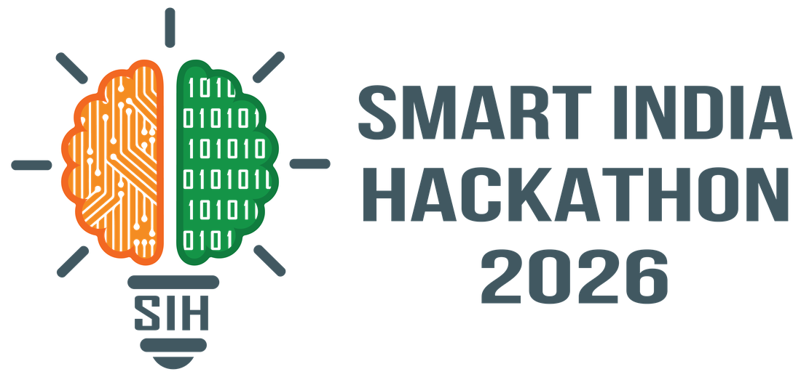
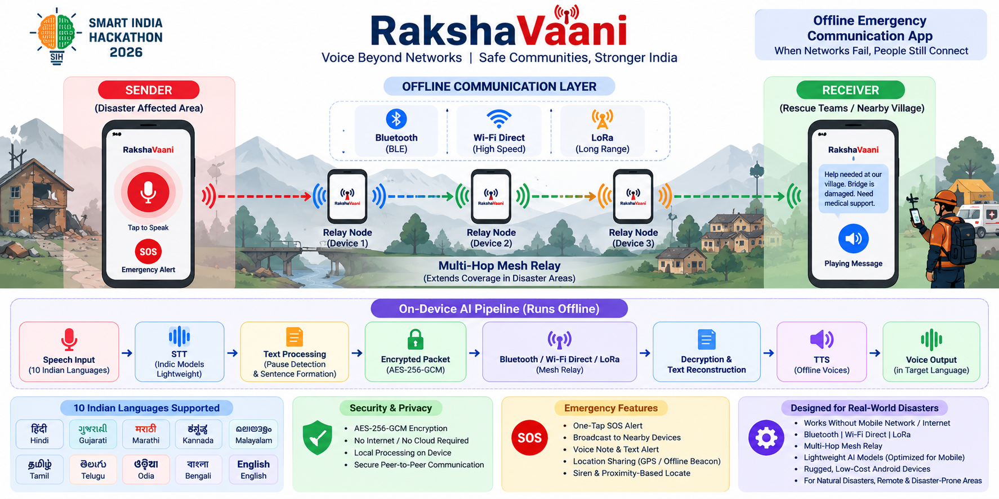
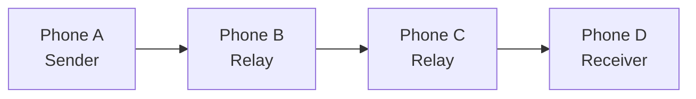

<div align="center">

<picture>
  <source media="(prefers-color-scheme: dark)" srcset="docs/assets/sih-2026-dark.png">
  
</picture>

<br><br>

# RakshaVaani (रक्षावाणी)

**Offline-First Multilingual Emergency Communication System**<br>
*Voice Communication When Connectivity Fails*

Smart India Hackathon 2026 · Team **StarkDynamics** · GMR Institute of Technology

<br>


<br>



</div>

<br>

> **When the network disappears, communication should not.**

RakshaVaani is an **offline-first multilingual emergency communication system** designed for disaster situations where cellular networks, internet connectivity, and conventional communication infrastructure may be unavailable.

Instead of transmitting voice recordings, RakshaVaani processes speech **on the device**, converts it into compact text data, securely transmits the data through available local communication technologies, and reconstructs the message as speech on the receiving device.

**No internet. No SIM card. No cloud server required at runtime.**

---

## 🚨 The Problem

During floods, cyclones, earthquakes, landslides, and other disasters, communication infrastructure can become unreliable or completely unavailable.

Emergency communication faces two major challenges:

### 1. Zero Connectivity

Conventional calling, messaging, and VoIP applications depend on cellular or internet infrastructure.

When towers, backhaul networks, or local connectivity fail, these communication methods can become unusable.

### 2. Language Barriers

Emergency teams and affected communities may speak different Indian languages.

Even when two people are physically close enough to communicate, language differences can prevent critical information from being understood quickly.

RakshaVaani addresses both problems through:

- On-device Speech-to-Text
- Compact text-based communication
- Offline radio-based connectivity
- Store-and-forward relay
- Offline Text-to-Speech
- Multilingual communication
- Emergency alerts
- Secure message transmission

---

## 🌟 How RakshaVaani Works

RakshaVaani follows a:

**Speech → Text → Secure Packet → Offline Radio → Text → Speech**

pipeline.


The important design principle is that **raw voice audio does not need to cross the communication link**.

Speech is recognised locally, the resulting message is compacted and encrypted, and the receiving handset reconstructs speech locally.

---

## 📡 Offline Communication Architecture

RakshaVaani is designed around a multi-radio communication layer.

```text
                 ┌──────────────────┐
                 │    SENDER PHONE  │
                 │                  │
                 │ Microphone       │
                 │      ↓           │
                 │ Offline STT      │
                 │      ↓           │
                 │ Compact Frame    │
                 │      ↓           │
                 │ AES-256-GCM      │
                 └────────┬─────────┘
                          │
             Offline Ad-Hoc Communication
                          │
             ┌────────────┼────────────┐
             │            │            │
             ▼            ▼            ▼
        Bluetooth      BLE         Wi-Fi Direct
             │            │            │
             └────────────┼────────────┘
                          │
                          ▼
                 ┌──────────────────┐
                 │   RELAY PHONE    │
                 │    (Optional)    │
                 │                  │
                 │ Deduplicate      │
                 │ TTL / Hop Control│
                 │ Forward          │
                 └────────┬─────────┘
                          │
                          ▼
                 ┌──────────────────┐
                 │  RECEIVER PHONE  │
                 │                  │
                 │ Decrypt          │
                 │      ↓           │
                 │ Decode Text      │
                 │      ↓           │
                 │ Offline TTS      │
                 │      ↓           │
                 │ 🔊 Voice Output  │
                 └──────────────────┘
```

---

## 🗣️ Multilingual Communication

RakshaVaani is designed for **10 Indian languages**:

| Language | Supported |
| --- | :---: |
| English | ✓ |
| Hindi | ✓ |
| Bengali | ✓ |
| Marathi | ✓ |
| Telugu | ✓ |
| Tamil | ✓ |
| Gujarati | ✓ |
| Kannada | ✓ |
| Malayalam | ✓ |
| Odia | ✓ |

The system is designed so that users can communicate through speech while the underlying communication layer transmits compact text representations.

---

## ⚡ Why Text Instead of Voice?

Raw voice requires substantially more data than a compact textual representation.

For a short emergency message, the communication path can therefore be:

```text
Raw Speech
   ↓
On-Device STT
   ↓
Compact Text
   ↓
Encryption
   ↓
Radio
   ↓
Decryption
   ↓
Text
   ↓
On-Device TTS
   ↓
Speech
```

The radio link carries the **message meaning**, rather than the entire audio waveform.

This is particularly valuable for constrained or low-bandwidth communication links.

---

## 🎤 Voice Communication

### Sender

The sender holds the communication control and speaks naturally.

```text
Microphone
    ↓
Audio Capture
    ↓
Streaming / On-Device STT
    ↓
Recognised Text
    ↓
Frame Encoding
    ↓
Encryption
```

### Receiver

The receiving device performs the reverse operation:

```text
Encrypted Packet
      ↓
Decryption
      ↓
Frame Decoding
      ↓
Text Normalisation
      ↓
Offline TTS
      ↓
🔊 Emergency Voice
```

Both users interact primarily through **speech**, while the communication system works with compact text internally.

---

## 🔁 Store-and-Forward Mesh

A device can act as an intermediate relay when the sender and receiver are not directly within communication range.



Relay processing includes:

1. Receive incoming frame.
2. Check the packet against the seen-set.
3. Prevent duplicate forwarding.
4. Decrement hop/TTL information.
5. Forward when the packet is still eligible.

The current protocol design includes a **3-bit TTL**, supporting up to **7 relay hops**, together with duplicate detection and randomized forwarding jitter.

---

## 🚨 Emergency Features

### High-Priority Alerts

Emergency alerts receive priority over ordinary communication.

The system can provide:

- Immediate alert delivery
- High-priority playback
- Visual alert indication
- Emergency acoustic notification

### 3-Second Lock Gate

The emergency interaction includes a deliberate activation period to reduce accidental triggers during stressful or adverse conditions.

### DND-Bypassing Emergency Siren

Emergency notifications can use a high-priority acoustic alarm to ensure that critical alerts are noticeable.

### LOCATE

The **LOCATE** feature uses radio signal information and acoustic feedback to help users identify the proximity/direction of another participating device.

---

## 🔐 Security

RakshaVaani uses **AES-256-GCM authenticated encryption** for message transport.

The protocol is designed to provide:

- Confidentiality
- Integrity
- Authentication
- Protection against message modification
- Protection against unauthorised message injection

The frame header can be authenticated as **Additional Authenticated Data (AAD)**.

The protocol also incorporates:

- Monotonic epoch counters
- Packet sequence tracking
- Duplicate detection
- TTL / hop control

These mechanisms help protect the mesh against replay and uncontrolled packet propagation.

---

## 🧠 AI Architecture

RakshaVaani separates speech processing from communication transport.

```text
                 RAKSHAVAANI AI LAYER
                         │
        ┌────────────────┼────────────────┐
        ▼                ▼                ▼
       STT          Text Processing       TTS
        │                │                │
        ▼                ▼                ▼
  Speech → Text     Compact Frame      Text → Speech
        │                │                │
        └────────────────┼────────────────┘
                         ▼
                  Offline Transport
```

### Speech-to-Text

The system uses lightweight on-device speech recognition models so that speech can be converted into text without sending audio to a remote server.

### Text-to-Speech

Received text is converted back into speech locally using an offline TTS engine.

### Inference Runtime

The Android application integrates lightweight inference components through **Sherpa-ONNX / ONNX Runtime**.

---

## 🧩 Project Architecture

The project follows a modular Android architecture.

```text
sih2026/
│
├── app/                  # Main Android application and UI
│
├── core-proto/           # Binary frame codec, encryption and mesh router
│
├── core-audio/           # Audio capture and playback
│
├── core-asr/             # Speech-to-Text integration
│
├── core-tts/             # Text-to-Speech integration
│
├── core-link/            # Bluetooth / BLE / Wi-Fi communication
│
├── core-models/          # AI model and language resources
│
├── bench/                # Performance measurement and benchmarking
│
├── models/               # Model manifests and language resources
│
├── tools/                # Build and model utilities
│
└── docs/                 # Documentation and design assets
```

---

## 🛠️ Technology Stack

| Layer | Technology |
| --- | --- |
| Platform | Android |
| Language | Kotlin |
| UI | Jetpack Compose |
| Concurrency | Kotlin Coroutines / Flow |
| STT | On-device Indic speech recognition |
| TTS | Piper / VITS-based offline synthesis |
| Inference | Sherpa-ONNX / ONNX Runtime |
| Audio | Android Audio APIs |
| Communication | Bluetooth / BLE / Wi-Fi Direct |
| Extended Radio | LoRa / serial radio interface |
| Security | AES-256-GCM |
| Build | Gradle |

---

## 📂 Repository Structure

```text
sih2026/
│
├── app/
│   ├── src/
│   └── build.gradle.kts
│
├── core-proto/
│   └── src/
│
├── core-audio/
│   └── src/
│
├── core-asr/
│   └── src/
│
├── core-tts/
│   └── src/
│
├── core-link/
│   └── src/
│
├── core-models/
│   └── src/
│
├── bench/
│   └── src/
│
├── models/
│
├── tools/
│
├── docs/
│   └── assets/
│
├── gradle/
│
├── build.gradle.kts
├── settings.gradle.kts
└── README.md
```

---

## 📱 Application Flow

```text
Launch RakshaVaani
        ↓
Emergency Communication Screen
        ↓
Choose Language
        ↓
Hold to Talk
        ↓
Speak Emergency Message
        ↓
On-Device STT
        ↓
Secure Packet
        ↓
Offline Mesh
        ↓
Receiver
        ↓
Offline TTS
        ↓
Hear Message
```

The application also provides an **AI Model Setup** interface for preparing language models and voices required for offline operation.

---

## 🤖 AI Model Setup

RakshaVaani includes a model setup workflow for offline AI resources.

The prototype interface demonstrates language-specific model preparation for:

- English
- Hindi
- Telugu

The model setup screen presents STT and TTS resources with model sizes and preparation progress.

This allows the application to communicate the concept of **download once, operate offline** for supported language resources.

---

## 📡 Communication Transports

RakshaVaani abstracts different communication mechanisms behind a common transport layer.

### Bluetooth Classic

Useful for direct device-to-device communication between paired handsets.

### BLE

Provides lightweight local broadcast/communication capabilities.

### Wi-Fi Direct

Enables higher-throughput peer-to-peer communication without requiring a conventional Wi-Fi router.

### LoRa / External Radio

The architecture can interface with longer-range radio hardware through an appropriate serial/radio transport.

```text
                  RakshaVaani
                       │
                 Transport Layer
                       │
        ┌──────────────┼──────────────┐
        ▼              ▼              ▼
   Bluetooth          BLE       Wi-Fi Direct
                       │
                       ▼
                 External Radio
                  / LoRa / HF
```

---

## 📴 Offline-First Design

RakshaVaani is designed around the principle:

> **The emergency communication path should not depend on the internet.**

At runtime, the core communication pipeline is local:

```text
Microphone
    ↓
Local AI
    ↓
Local Text
    ↓
Local Encryption
    ↓
Local Radio
    ↓
Local Decryption
    ↓
Local AI
    ↓
Speaker
```

This makes the architecture suitable for environments where communication infrastructure has been damaged or is unavailable.

---

## 💾 Resource Efficiency

The project targets practical operation on entry-level Android devices.

The architecture uses:

- Quantized AI models
- ONNX-based inference
- Modular model loading
- Local processing
- Lightweight communication packets
- Memory-conscious audio processing

The goal is to avoid requiring flagship hardware for emergency communication.

---

## 🚀 Getting Started

### Prerequisites

Install:

- **JDK 17+**
- **Android Studio**
- **Android SDK**
- Android SDK Platform required by the project
- Android Build Tools
- Git

### Clone

```bash
git clone https://github.com/pavan201806/sih2026.git
cd sih2026
```

### Fetch Native Dependencies

```bash
chmod +x tools/fetch_sherpa.sh
./tools/fetch_sherpa.sh
```

### Build the APK

```bash
./gradlew assembleDebug
```

On Windows:

```powershell
.\gradlew.bat assembleDebug
```

The debug APK is generated under:

```text
app/build/outputs/apk/debug/app-debug.apk
```

---

## ☁️ Automated Build

The repository includes a GitHub Actions workflow for automated APK generation.

A workflow run can:

1. Provision the required Java environment.
2. Configure the Android build environment.
3. Fetch required native dependencies.
4. Build the Android application.
5. Upload the generated APK as a workflow artifact.

This provides a reproducible build path without requiring every contributor to maintain an identical local Android environment.

---

## 🧪 Demo Runbook

### 1. Install

Install the debug APK on two Android phones.

```text
Phone A = Sender
Phone B = Receiver
```

### 2. Prepare Connectivity

Pair or establish the required local communication path.

No internet connection is required for the communication demonstration.

### 3. Configure Language

Example:

```text
Phone A → Hindi
Phone B → Telugu
```

### 4. Send Speech

On Phone A:

```text
Hold "HOLD TO TALK"
        ↓
Speak emergency message
        ↓
Release
```

The application performs:

```text
Speech
 ↓
STT
 ↓
Text
 ↓
Frame Encoding
 ↓
Encryption
 ↓
Offline Transport
```

### 5. Receive

Phone B performs:

```text
Receive
 ↓
Decrypt
 ↓
Decode
 ↓
Text Processing
 ↓
TTS
 ↓
Voice Output
```

### 6. Emergency Alert

Trigger the emergency alert on the sender.

The receiver should receive the high-priority alert and provide the corresponding visual/acoustic notification.

---

## 🎯 Design Goals

RakshaVaani is built around five principles:

### 1. Connectivity Independence

Emergency communication should continue when cellular and internet infrastructure fails.

### 2. Meaning Over Audio

Transmit compact textual meaning instead of large raw voice recordings whenever possible.

### 3. Multilingual Communication

Emergency communication should not require all users to speak the same language.

### 4. Mesh Resilience

Nearby devices can cooperate as relay nodes to extend communication.

### 5. Resource Efficiency

The system should remain practical on affordable Android hardware.

---

## 📊 Project Status

The project prototype includes the major components required for the intended emergency communication workflow:

- Android application
- Offline STT pipeline
- Offline TTS pipeline
- Compact message transport
- AES-256-GCM security
- Bluetooth communication
- BLE communication architecture
- Wi-Fi Direct communication architecture
- Mesh relay design
- Emergency alerts
- LOCATE functionality
- Multilingual language resources
- AI Model Setup interface
- Automated Android build workflow

> **RakshaVaani is a prototype emergency communication system. Real-world disaster deployment would require extensive field validation, radio certification where applicable, device compatibility testing, security auditing, and safety verification.**

---

## 📈 Future Scope

Potential extensions include:

- Improved low-resource Indian-language models
- Additional regional languages
- More efficient model quantization
- Fully autonomous peer discovery
- Improved multi-hop routing
- Long-range LoRa integration
- Better indoor/outdoor locating
- Lower end-to-end latency
- Battery and thermal optimisation
- Adaptive model loading
- Larger field trials
- More robust emergency alert delivery

---

## 🔬 Research Direction

The project explores an alternative approach to emergency voice communication:

```text
Traditional Communication

Voice → Audio Codec → Radio → Audio Codec → Voice


RakshaVaani

Voice → STT → Compact Text → Radio → Text → TTS → Voice
```

The objective is to make emergency communication possible over links that may not have sufficient capacity for conventional voice transmission.

---

## 👥 Team

<div align="center">

### StarkDynamics

**GMR Institute of Technology (GMRIT)**  
Rajam, Andhra Pradesh, India

**Team ID: 145690**

| Role | Member |
| --- | --- |
| Team Leader | **A Pavankumar** |
| Team Member | **Karthikeyan Srinivas** |
| Team Member | **P Bharat Kumar** |
| Team Member | **M Bharath Kumar** |
| Team Member | **K Gunasri** |
| Team Member | **K Kalyani** |

**Smart India Hackathon 2026**

</div>

---

## 📄 License

See the repository license and third-party attribution files for the applicable licensing terms of the RakshaVaani codebase, AI models, voices, and dependencies.

Third-party components may carry their own licenses and usage restrictions.

---

<div align="center">

<br>

**RakshaVaani — Communication when connectivity fails.**

<br>

**Team StarkDynamics · Smart India Hackathon 2026 · GMR Institute of Technology**

</div>
